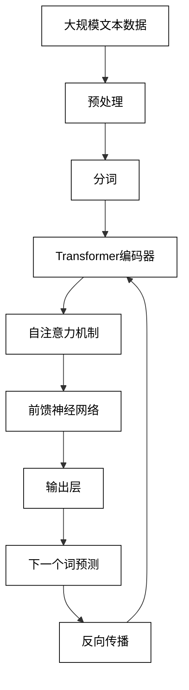
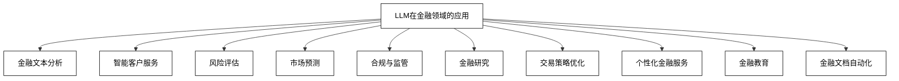
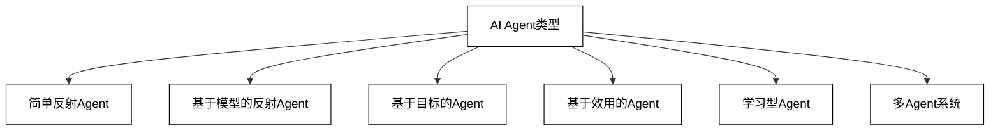
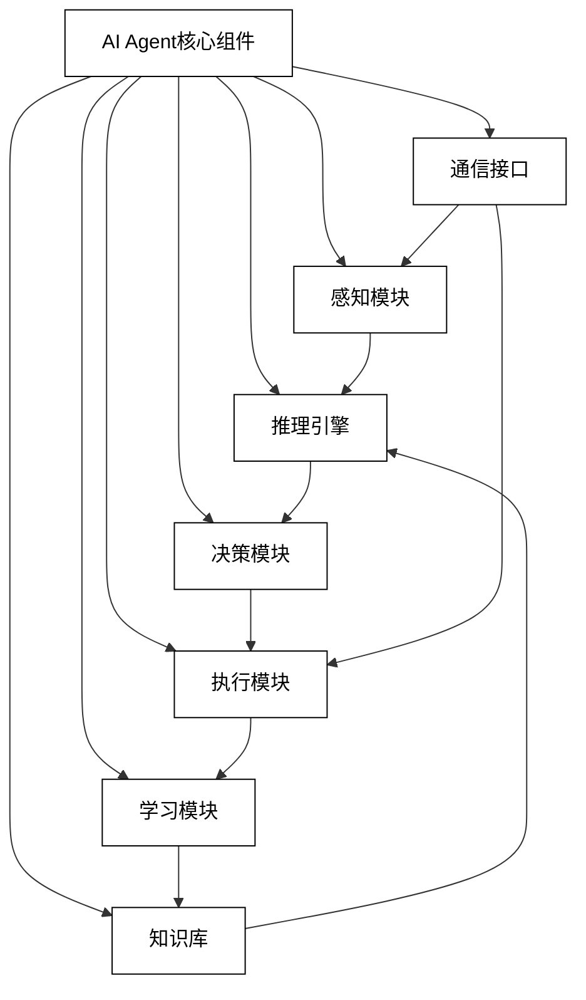
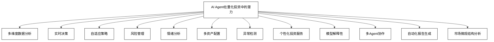
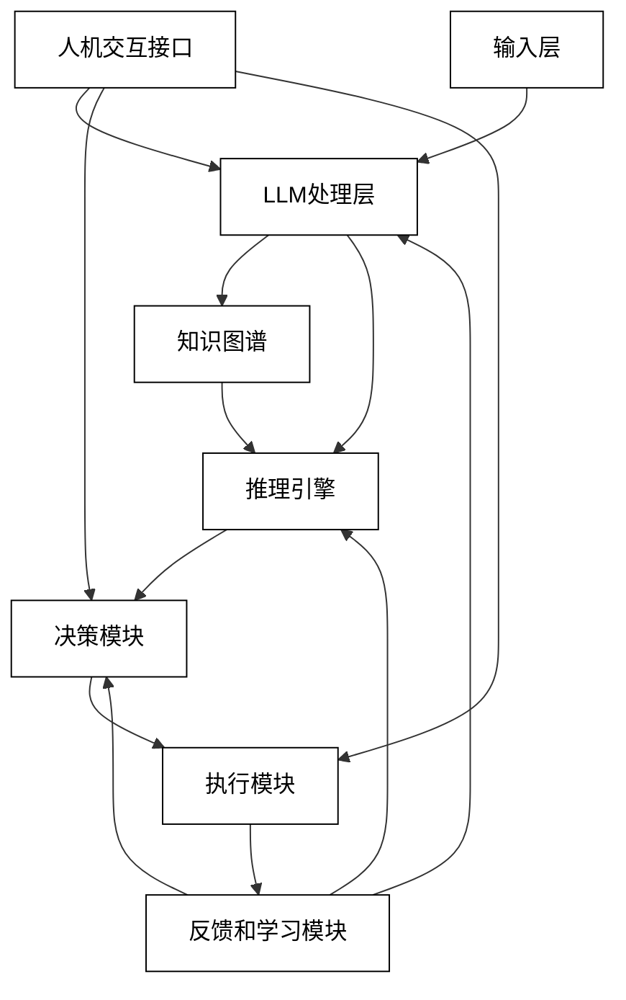
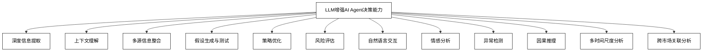
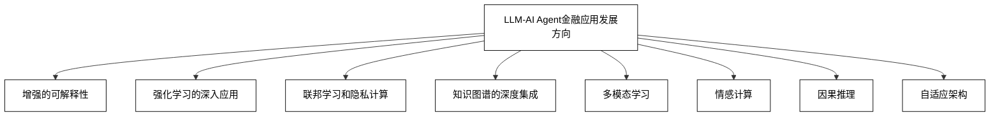

# 第一部分：基础理论

# 第1章：LLM大模型与AI Agent概述

## 1.1 LLM大模型简介

### 1.1.1 LLM的定义与特征

大型语言模型（Large Language Models，简称LLM）是一种基于深度学习技术的自然语言处理模型，它能够理解、生成和操纵人类语言。LLM的主要特征包括：

1. 大规模参数：现代LLM通常包含数十亿到数万亿个参数，使其能够捕捉语言的复杂性和细微差别。

2. 自监督学习：LLM主要通过自监督学习方式在大规模文本语料上进行训练，无需人工标注的数据。

3. 上下文理解：能够理解和利用长序列的上下文信息，从而生成连贯和相关的文本。

4. 多任务能力：一个LLM可以执行多种NLP任务，如文本生成、问答、摘要、翻译等，无需针对特定任务进行专门训练。

5. 少样本学习：通过提示工程（prompt engineering），LLM可以快速适应新任务，只需少量示例或指令。

6. 涌现能力：随着模型规模的增大，LLM展现出一些意想不到的能力，如推理、创造性写作等。

LLM的核心原理是基于Transformer架构，使用自注意力机制来处理序列数据。训练过程通常采用下一个词预测任务，使模型能够学习语言的统计规律和语义关系。

### 1.1.2 主流LLM模型介绍

当前主流的LLM模型包括：

1. GPT系列（OpenAI）：
    - GPT-3：1750亿参数，通用语言理解和生成能力强。
    - GPT-4：参数规模未公开，多模态能力，推理能力显著提升。

2. BERT系列（Google）：
    - BERT：3.4亿参数，双向编码，适合理解任务。
    - RoBERTa：改进版BERT，训练方法优化。

3. T5（Google）：
    - 统一了多种NLP任务的框架，将所有任务视为文本到文本的转换。

4. LaMDA（Google）：
    - 对话型AI模型，专注于开放域对话。

5. PaLM（Google）：
    - 5400亿参数，在多种任务上展现出强大性能。

6. LLaMA（Meta）：
    - 开源模型，有65B、33B、13B和7B等不同规模版本。

7. BLOOM：
    - 多语言开源模型，1760亿参数。

8. ChatGLM系列（清华大学）：
    - 中英双语对话模型，有130B和6B等不同规模版本。

这些模型在参数规模、训练数据、架构设计等方面各有特点，适用于不同的应用场景。

| 模型名称 | 参数规模 | 开发机构 | 主要特点 |
|---------|---------|---------|---------|
| GPT-3   | 1750亿  | OpenAI  | 通用语言能力强 |
| GPT-4   | 未公开  | OpenAI  | 多模态，推理能力强 |
| BERT    | 3.4亿   | Google  | 双向编码，适合理解任务 |
| T5      | 110亿   | Google  | 统一多任务框架 |
| LaMDA   | 1370亿  | Google  | 专注开放域对话 |
| PaLM    | 5400亿  | Google  | 大规模，多任务性能强 |
| LLaMA   | 65B-7B  | Meta    | 开源，多种规模 |
| BLOOM   | 1760亿  | BigScience | 多语言开源 |
| ChatGLM | 130B-6B | 清华大学 | 中英双语对话 |

### 1.1.3 LLM在金融领域的应用前景

LLM在金融领域展现出巨大的应用潜力，主要包括以下方面：

1. 金融文本分析：
    - 自动化分析财报、新闻、研报等文本信息。
    - 提取关键信息，识别市场情绪和趋势。

2. 智能客户服务：
    - 24/7全天候金融咨询和问答服务。
    - 个性化金融产品推荐。

3. 风险评估：
    - 分析非结构化数据以评估信用风险。
    - 识别潜在的欺诈行为。

4. 市场预测：
    - 结合多源信息进行市场趋势预测。
    - 辅助投资决策制定。

5. 合规与监管：
    - 自动化合规检查和报告生成。
    - 识别潜在的监管风险。

6. 金融研究：
    - 自动生成研究报告和市场分析。
    - 辅助复杂金融模型的构建和解释。

7. 交易策略优化：
    - 分析历史交易数据，提出优化建议。
    - 模拟不同市场情景下的策略表现。

8. 个性化金融服务：
    - 根据客户数据和市场情况提供定制化投资建议。
    - 智能资产配置和财富管理。

9. 金融教育：
    - 为投资者提供个性化的金融知识学习内容。
    - 模拟交易环境，辅助投资技能培训。

10. 金融文档自动化：
    - 自动生成合同、协议等法律文档。
    - 简化金融产品说明书的编写过程。

LLM在金融领域的应用前景广阔，但同时也面临着一些挑战，如数据隐私保护、模型解释性、实时性要求等。随着技术的不断进步和行业规范的完善，LLM有望在金融创新和风险管理中发挥越来越重要的作用。

## 1.2 AI Agent技术概述

### 1.2.1 AI Agent的定义与类型

AI Agent（人工智能代理）是一种能够感知环境、做出决策并采取行动以实现特定目标的智能系统。在计算机科学和人工智能领域，Agent是一个基本概念，代表了一个能够自主行动的实体。

AI Agent的核心特征包括：

1. 自主性：能够在没有直接人类干预的情况下做出决策和采取行动。
2. 反应性：能够感知环境并及时做出响应。
3. 主动性：不仅被动响应环境，还能主动采取行动以实现目标。
4. 社交能力：能够与其他Agent或人类进行交互和协作。

AI Agent的类型：

1. 简单反射Agent：
    - 基于当前感知直接做出反应，不考虑历史信息或未来影响。
    - 例如：简单的温度控制器。

2. 基于模型的反射Agent：
    - 维护内部状态来追踪环境的变化。
    - 例如：自动驾驶汽车中的障碍物跟踪系统。

3. 基于目标的Agent：
    - 考虑行动的结果，选择能够达成目标的行动。
    - 例如：国际象棋AI。

4. 基于效用的Agent：
    - 评估每个可能状态的"效用"，选择最大化效用的行动。
    - 例如：股票交易AI。

5. 学习型Agent：
    - 能够从经验中学习并改进其行为。
    - 例如：强化学习的游戏AI。

6. 多Agent系统：
    - 多个Agent协同工作，解决复杂问题。
    - 例如：分布式传感器网络。

在金融领域，AI Agent通常是基于效用的和学习型的，能够处理复杂的市场环境和大量的数据，做出智能的投资决策。

### 1.2.2 AI Agent的核心组件

AI Agent的核心组件包括：

1. 感知模块（Perception Module）：
    - 功能：收集和处理环境信息。
    - 金融应用：市场数据采集、新闻分析、社交媒体情绪监测。

2. 知识库（Knowledge Base）：
    - 功能：存储领域知识和历史经验。
    - 金融应用：金融理论模型、历史交易数据、公司基本面信息。

3. 推理引擎（Reasoning Engine）：
    - 功能：基于知识和当前状态进行逻辑推理。
    - 金融应用：风险评估、市场趋势分析、投资机会识别。

4. 决策模块（Decision Making Module）：
    - 功能：选择最优行动方案。
    - 金融应用：投资组合优化、交易时机选择、风险管理策略制定。

5. 执行模块（Execution Module）：
    - 功能：将决策转化为具体行动。
    - 金融应用：自动交易执行、订单管理、头寸调整。

6. 学习模块（Learning Module）：
    - 功能：从经验中学习，不断优化决策过程。
    - 金融应用：策略参数调优、模型更新、新模式识别。

7. 通信接口（Communication Interface）：
    - 功能：与其他Agent或人类用户交互。
    - 金融应用：多Agent协作交易、人机交互界面、报告生成。

这些组件之间紧密协作，形成一个闭环系统，使AI Agent能够持续感知环境、学习新知识、做出决策并执行行动。

### 1.2.3 AI Agent在量化投资中的潜力

AI Agent在量化投资领域展现出巨大潜力，主要体现在以下方面：

1. 多维度数据分析：
    - 能够同时处理结构化和非结构化数据。
    - 整合市场数据、财务报表、新闻、社交媒体等多源信息。

2. 实时决策：
    - 快速响应市场变化，进行实时交易决策。
    - 适应高频交易和算法交易的需求。

3. 自适应策略：
    - 通过强化学习不断优化交易策略。
    - 适应不同市场环境和经济周期。

4. 风险管理：
    - 全面评估市场风险、信用风险、操作风险等。
    - 实时监控和动态调整风险敞口。

5. 情绪分析：
    - 分析新闻、社交媒体等数据，捕捉市场情绪。
    - 预测短期市场波动和趋势反转。

6. 多资产配置：
    - 跨市场、跨资产类别的全局优化。
    - 动态调整投资组合，平衡风险和收益。

7. 异常检测：
    - 识别市场异常和潜在的套利机会。
    - 早期预警系统，防范系统性风险。

8. 个性化投资服务：
    - 根据客户风险偏好和投资目标定制策略。
    - 提供智能化的投资建议和组合管理。

9. 模型解释性：
    - 提供决策依据和逻辑解释。
    - 增强投资决策的透明度和可信度。

10. 多Agent协作：
    - 不同Agent负责不同的投资策略或资产类别。
    - 通过协作实现更全面的市场覆盖和风险分散。

11. 自动化报告生成：
    - 生成详细的投资分析报告和业绩归因。
    - 满足监管要求和客户沟通需求。

12. 市场微观结构分析：
    - 深入分析订单簿数据，优化交易执行。
    - 识别市场流动性模式和价格形成机制。

AI Agent在量化投资中的应用正在重塑传统的投资流程和决策模式。通过结合先进的机器学习算法、大数据分析技术和领域专业知识，AI Agent有潜力提高投资效率、降低风险、发现新的投资机会，从而在竞争激烈的金融市场中获得优势。

然而，在充分发挥AI Agent潜力的同时，也需要注意一些挑战和限制：

1. 数据质量和可靠性：AI Agent的性能很大程度上依赖于输入数据的质量。
2. 模型的稳定性：需要确保AI Agent在不同市场环境下都能保持稳定表现。
3. 过拟合风险：避免模型过度拟合历史数据，失去对未来的预测能力。
4. 监管合规：确保AI Agent的决策和行为符合金融监管要求。
5. 伦理考虑：平衡追求利润和社会责任，避免对市场造成不当影响。

随着技术的不断进步和实践经验的积累，AI Agent在量化投资中的应用将更加成熟和广泛，有望成为未来金融市场的重要参与者和创新驱动力。

## 1.3 LLM与AI Agent的结合

### 1.3.1 LLM驱动的AI Agent架构

LLM驱动的AI Agent架构是将大型语言模型的强大语言理解和生成能力与AI Agent的决策和执行能力相结合的创新系统。这种架构旨在创造一个更智能、更灵活的投资决策系统。以下是LLM驱动的AI Agent架构的主要组成部分：

1. 输入层：
    - 市场数据接口：实时接收市场价格、交易量等数据。
    - 新闻和社交媒体接口：收集文本形式的市场信息。
    - 财务报表分析器：处理公司财务数据。

2. LLM处理层：
    - 文本理解模块：解析和理解各种金融文本。
    - 情感分析模块：评估市场情绪。
    - 事件提取模块：识别重要的市场事件。
    - 数据综合模块：整合来自不同源的信息。

3. 知识图谱：
    - 金融实体关系库：存储公司、行业、产品等实体间的关系。
    - 历史事件数据库：记录过去的重大市场事件及其影响。

4. 推理引擎：
    - 基于规则的推理：应用传统金融理论和经验规则。
    - 基于模型的推理：使用统计和机器学习模型进行预测。
    - 因果推理：分析事件之间的因果关系。

5. 决策模块：
    - 策略生成器：基于LLM输出和推理结果生成投资策略。
    - 风险评估器：评估每个策略的潜在风险。
    - 投资组合优化器：优化资产配置。

6. 执行模块：
    - 订单管理系统：生成和管理交易订单。
    - 执行算法：优化交易执行以减少市场影响。

7. 反馈和学习模块：
    - 性能评估：分析交易结果和策略表现。
    - 模型更新：基于新数据和反馈调整模型参数。

8. 人机交互接口：
    - 自然语言查询：允许用户用自然语言提问和下达指令。
    - 可视化仪表板：展示市场分析和投资决策过程。

这种架构的优势在于：

1. 强大的信息处理能力：LLM可以处理和理解大量非结构化数据。
2. 灵活的决策制定：结合规则基础和机器学习方法。
3. 持续学习和适应：通过反馈循环不断优化系统性能。
4. 高度可解释性：LLM可以生成决策理由的自然语言解释。
5. 多模态输入处理：可以同时处理数值、文本、图像等多种数据类型。

### 1.3.2 LLM增强AI Agent的决策能力

LLM可以通过多种方式增强AI Agent的决策能力，使其在复杂的金融市场环境中做出更智能、更全面的投资决策：

1. 深度信息提取：
    - LLM可以从大量文本数据中提取关键信息，包括新闻报道、研究报告、社交媒体等。
    - 识别潜在的市场驱动因素和风险因素。

2. 上下文理解：
    - 理解复杂的金融术语和概念，考虑历史背景和当前市场环境。
    - 解读政策声明和央行报告，评估其对市场的潜在影响。

3. 多源信息整合：
    - 综合分析来自不同来源的信息，如市场数据、公司财报、行业报告等。
    - 识别信息之间的关联性，形成全面的市场洞察。

4. 假设生成与测试：
    - 基于当前市场状况生成多个投资假设。
    - 使用历史数据和模拟测试这些假设的有效性。

5. 策略优化：
    - 根据市场反馈和新信息动态调整投资策略。
    - 提出创新的交易思路和组合策略。

6. 风险评估：
    - 全面分析潜在风险，包括市场风险、信用风险、操作风险等。
    - 生成风险缓解建议和应急计划。

7. 自然语言交互：
    - 允许人类分析师通过自然语言查询复杂的市场情况。
    - 生成易于理解的投资建议和市场分析报告。

8. 情感分析：
    - 分析市场情绪和投资者心理，预测可能的非理性行为。
    - 识别市场过度乐观或悲观的情况。

9. 异常检测：
    - 识别市场异常模式和潜在的套利机会。
    - 提前预警可能的市场风险或系统性问题。

10. 因果推理：
    - 分析事件之间的因果关系，预测政策变化或经济事件的市场影响。
    - 构建复杂的因果链，理解深层次的市场动态。

11. 多时间尺度分析：
    - 同时考虑短期、中期和长期的市场趋势。
    - 在不同时间框架下优化投资决策。

12. 跨市场关联分析：
    - 分析不同资产类别和地理市场之间的相互影响。
    - 识别全球宏观经济趋势对特定市场的影响。

通过这些方式，LLM显著增强了AI Agent的认知和决策能力，使其能够更好地理解复杂的市场环境，做出更明智的投资决策。这种结合不仅提高了量化投资的效率和准确性，还为开发更复杂、更智能的投资策略提供了可能性。

### 1.3.3 案例分析：金融领域的LLM-AI Agent应用

以下是几个具体的案例，展示了LLM-AI Agent在金融领域的实际应用：

1. 智能投资顾问系统

描述：结合LLM和AI Agent技术开发的个人理财助手。

关键特性：
- 自然语言交互界面
- 个性化投资组合推荐
- 实时市场分析和风险评估
- 自动化再平衡和税收优化

实现方式：
- LLM负责理解客户需求、解释市场动态
- AI Agent执行投资决策、管理投资组合
- 知识图谱存储客户信息和市场数据

效果：
- 提高客户参与度和满意度
- 降低人工成本，扩大服务覆盖范围
- 实现更精准的风险管理和资产配置

2. 高频交易策略优化器

描述：利用LLM-AI Agent分析市场微观结构，优化高频交易策略。

关键特性：
- 实时订单簿分析
- 新闻和社交媒体情绪集成
- 动态策略调整
- 异常检测和风险控制

实现方式：
- LLM处理实时新闻流和社交媒体数据
- AI Agent分析订单簿数据，执行交易决策
- 强化学习模块不断优化策略参数

效果：
- 提高交易胜率和收益率
- 减少市场冲击成本
- 快速适应市场微观结构变化

3. 企业信用风险评估系统

描述：结合财务数据分析和非结构化信息处理的信用风险评估工具。

关键特性：
- 多源数据整合（财报、新闻、社交媒体、行业报告）
- 动态信用评分
- 早期预警机制
- 详细风险报告生成

实现方式：
- LLM分析公司公告、新闻报道等非结构化数据
- AI Agent整合财务指标和质性信息，生成信用评分
- 知识图谱构建公司关联网络，评估关联风险

效果：
- 提高信用风险评估的准确性和及时性
- 捕捉传统方法可能忽视的风险信号
- 生成全面、易懂的风险分析报告

4. 宏观经济预测与政策分析工具

描述：基于LLM-AI Agent的宏观经济分析和政策影响评估系统。

关键特性：
- 全球经济指标追踪
- 政策文件解读
- 跨市场关联分析
- 情景模拟和压力测试

实现方式：
- LLM分析央行报告、政府政策文件等
- AI Agent构建和维护宏观经济模型
- 多Agent系统模拟不同经济体之间的相互作用

效果：
- 提供及时、深入的宏观经济洞察
- 评估政策变化对不同资产类别的影响
- 辅助制定宏观投资策略

5. 智能财报分析师

描述：自动化公司财务报告分析和估值系统。

关键特性：
- 自动提取关键财务指标
- 同行业比较分析
- 异常检测和欺诈风险评估
- 自然语言生成财报摘要

实现方式：
- LLM理解和解析财务报告文本
- AI Agent执行财务模型计算和估值
- 知识图谱存储公司历史数据和行业信息

效果：
- 大幅提高财报分析效率
- 识别潜在的财务风险和投资机会
- 生成结构化和易理解的分析报告

这些案例展示了LLM-AI Agent在金融领域的广泛应用潜力。通过结合LLM的强大语言处理能力和AI Agent的决策执行能力，这些系统能够处理复杂的金融任务，提供更深入的市场洞察，并做出更智能的投资决策。

以下是这些应用案例的比较分析：

| 应用案例 | LLM主要作用 | AI Agent主要作用 | 主要优势 | 潜在挑战 |
|---------|------------|-----------------|---------|---------|
| 智能投资顾问系统 | 自然语言交互、市场分析 | 投资组合管理、风险控制 | 个性化服务、24/7可用 | 监管合规、客户信任 |
| 高频交易策略优化器 | 新闻情绪分析 | 订单执行、策略调整 | 快速反应、高效执行 | 技术复杂性、系统风险 |
| 企业信用风险评估系统 | 非结构化数据分析 | 信用评分、风险预警 | 全面风险评估、早期预警 | 数据质量、模型解释性 |
| 宏观经济预测与政策分析工具 | 政策文件解读 | 经济模型构建、情景模拟 | 深度洞察、跨市场分析 | 模型复杂性、预测准确性 |
| 智能财报分析师 | 财报文本理解 | 财务建模、估值计算 | 效率提升、一致性分析 | 处理非标准报告、法律责任 |

这些案例表明，LLM-AI Agent系统在金融领域有着广泛的应用前景，能够显著提高分析效率、决策质量和服务水平。然而，在实际应用中还面临着一些共同的挑战：

1. 数据质量和可靠性：
    - 确保输入数据的准确性和及时性。
    - 处理数据缺失和噪声问题。

2. 模型解释性：
    - 提供清晰、可理解的决策依据。
    - 满足监管对透明度的要求。

3. 实时性能：
    - 在高频交易等场景中保证低延迟。
    - 处理大规模实时数据流。

4. 安全性和隐私保护：
    - 保护敏感金融数据和客户信息。
    - 防范潜在的网络安全威胁。

5. 监管合规：
    - 适应不断变化的金融监管环境。
    - 确保系统行为符合道德和法律标准。

6. 模型偏差：
    - 识别和减少数据和算法中的潜在偏见。
    - 确保公平和包容的金融服务。

7. 系统稳定性：
    - 处理极端市场条件下的稳定性。
    - 防范系统性风险和级联失败。

8. 人机协作：
    - 设计有效的人机交互界面。
    - 平衡自动化和人工监督。

为了应对这些挑战，未来的LLM-AI Agent系统在金融领域的发展方向可能包括：

1. 增强的可解释性：开发更先进的模型解释技术，使AI的决策过程更透明。

2. 强化学习的深入应用：利用强化学习技术使系统能够在复杂的市场环境中不断学习和适应。

3. 联邦学习和隐私计算：采用分布式学习技术，在保护数据隐私的同时实现多方协作。

4. 知识图谱的深度集成：构建更全面的金融知识图谱，增强系统的推理能力。

5. 多模态学习：整合文本、数值、图像等多种数据类型，提供更全面的市场洞察。

6. 情感计算：深入研究投资者心理和市场情绪，更好地预测市场行为。

7. 因果推理：增强系统的因果分析能力，更准确地评估事件影响和预测市场变化。

8. 自适应架构：开发能够根据市场条件自动调整的系统架构，提高系统的鲁棒性。

总结来说，LLM-AI Agent在金融领域的应用正在快速发展，并显示出巨大的潜力。通过不断创新和优化，这些系统有望revolutionize金融行业的决策过程、风险管理和客户服务。然而，实现这一潜力需要技术创新、行业合作和适当的监管框架的共同努力。随着技术的成熟和应用的深入，我们可以期待看到更多创新的金融应用案例，推动整个行业向更智能、更高效的方向发展。
